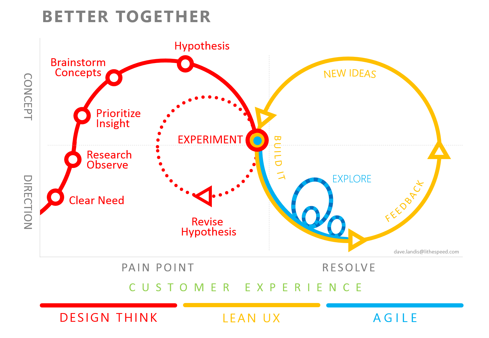
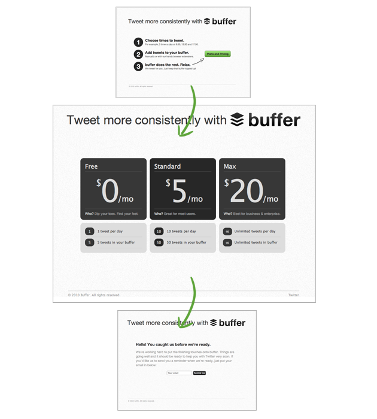
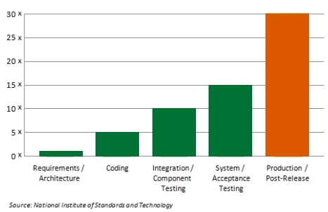
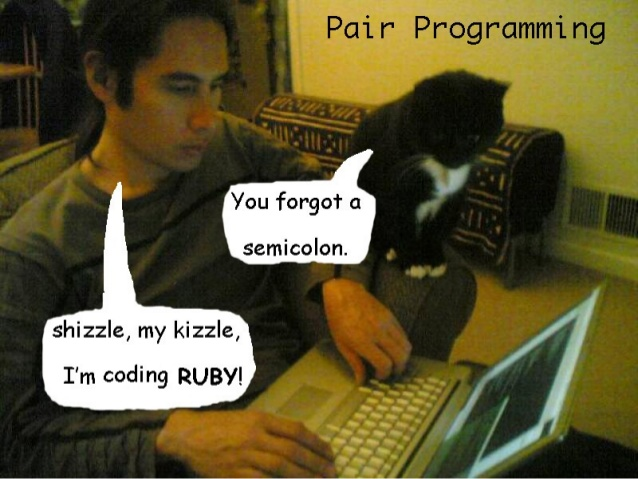
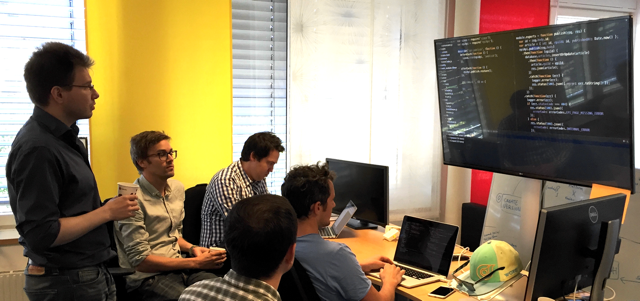
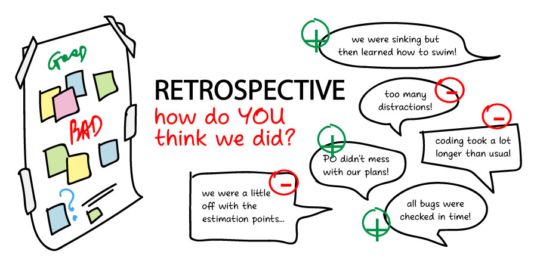
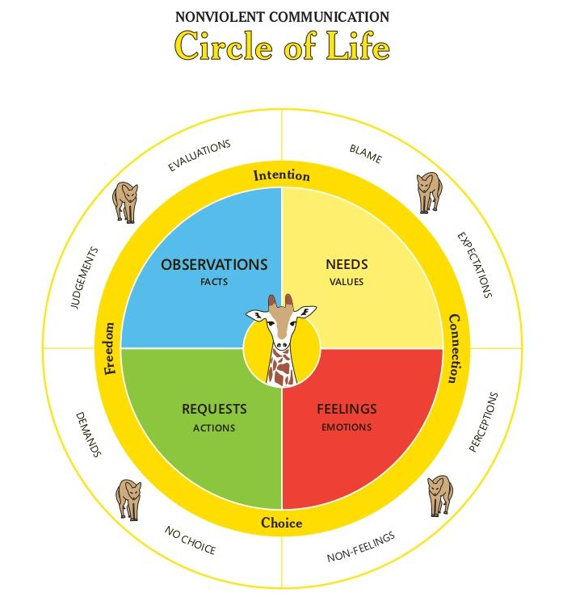

class: center, middle

# Make the right product, the right way with the right team
.octo-logo[]

---
class: center, middle

## The importance of feedbacks

.img-full-size[]

???

# TIBO

each project phases:
 - discussion for the problem
 - solution
 - link to feedback

---
class: center, middle

## How do you make a product users need?


???

Problem:

 - Hey I got the best idea in the world, it's the next Facebook !!
 - how are you so sure
 - I know it's going to work just fine
 - How about we test that first?
 - Yeah you are right let's build it right now and we will see!

Solutions: MVP
 - get early feedback with the least amnout of energy/time/money
 - example: Dropbox create a video

---
class: center, middle
.left[
### [Lean] Buffer's MVP: landing page
]

.img-full-size[]

???
# TIBO
engage customer with landing but no product, got a few early adopters to talk to and get needs first

---

class: center, middle

## Is this technically doable?


???


Problem:

 - Hey Thibaut, I have tons of data in different databases that I would like to ingest in my datalake! But the compliance team preconize to use encryption from end to end and we don't have a lot of engineers.
 - Ok so you don't know if this is doable and which product on the market can do it?
 - Exact also I don't know if the design of my future architecture is what I need.
 - I am hesitating between two but I like one more.
 - How about we try the technology with one db first?

---

class: center, middle

.left[
## Proof of Concept
]

.img-full-size[]

???
# NICO


Solution: make a Proof Of Concept
- it helps to convince management that this is worthwhile to invest more heavily on a particuliar solution.
- try the technology, fail quickly, get feedbacks early, learn from it then be able to use what fits the best your needs.

---

class: center, middle

## How can I make a better application for my customers?


???

Problem:

 - Hey Nick, I have an application in production since a bit of time and every time we develop a new feature.
 - Do you you spend a lot of time to fix bugs every time you implement anything?
 - Yes, and on some parts of the code it is too painful to test it.

---

class: center, middle
.left[
### [Craftsmanship] Unit tests
]

.img-full-size[]


???

# NICO

Solution:

 - Fix recurring bugs
 - To Fix the fact that you have tons of bugs to fix: add unit tests every time you have a bug
 - feedback
 - refactor

---

class: center, middle
.left[
### [Craftsmanship] Test Driven Development
]


???

# TIBO


Solution:
- As it is too hard to test, the code is probably too tightly coupled, functionalities are probably mixed and design might not be adequate.
- TDD will help to simplify solution, force dev to decouple the app components and make the app modular, design should emerge step by step.
- Force to divide big problems into smaller ones.
- We know a lot more quickly if a piece of code is working. Short-ciruit feedback loop.
- Tests are not influenced by implementation.

---

class: center, middle

## How is it possible to meet the expected requirements?


???

Problem:

 - Hey Thibaut, every time I develop a Jira ticket my business analyst are rejected even though I am certain beforehands that it is completed.
 - What happens? Features don't work? Or are there some misunderstanding?
 - Sometimes I think what I am doing is what is needed but it appears that I don't meet all the key details.
 - Do you have an easy way to find out what has been developped before ?
 - Actually it is also very hard because everything is dug into a long pile of Jira Tickets.

---

class: center, middle
.left[
### [Craftsmanship] Specification by example - ATDD
]

.img-full-size[]


???

# NICO

Solution:
- Specification by example
- ATDD / BDD
- Specs are up-to-date
- Avoid to have regression
- feedback quick and reliable when automated.

---
class: center, middle

## How to create team's standard?


--

```bash
clear;while x=0; do clear;date;echo "";echo "  [Count] | [IP ADDR]"; \
echo "-------------------";netstat -np|grep :80|grep -v LISTEN \
|awk '{print $5}'|cut -d: -f1|uniq -c; sleep 5;done
```
> Displays the quantity of connections to port 80 on a per IP basis

???

# NICO

Problem:
 - We hired this expert last month but he's writing code that is super good but super hard to understand.
 - what do you mean?
 - lately he has written an bash oneliner for a story which is pretty cool but...
 - intercept bug
 - maintenability/readability
 - what happen if the expert is not here (bus faxtor)

**easrly code feedback**

---

class: center, middle

.left[
### [Craftsmanship] Code Review
]

.code-review-commic[]


???

Get some feedback early to create some team standard on your code.
For better result, you can review the code by the whole team, it speeds up the creation (useful for the bootstrap of the team)

---
class: center, middle
.left[
### [Craftsmanship] Team Review
]
.img-full-size[]

---
class: center, middle

## How to grow as a developer?


--

```bash
clear;while x=0; do clear;date;echo "";echo "  [Count] | [IP ADDR]"; \
echo "-------------------";netstat -np|grep :80|grep -v LISTEN \
|awk '{print $5}'|cut -d: -f1|uniq -c; sleep 5;done
```

???

# TIBO

- but I kinda want to be able to write those one liners?
- like... really ?!?!?!
- Yes

---
class: center, middle
.left[
### [Craftsmanship] Pair programming
]
.img-full-size[]

???

When coding:
 - instead feedback on your code by some else => make sure you're code is readable or functional

When assisting
 - learning from the other person:
 - what is this super sweet hotkey to extract a method in IDEA
 - what is this pattern you are using?

---
class: center, middle
.left[
### [Craftsmanship] Mob programming
]
.img-medium-size[]


???
exactly the same by getting feedback from more people.
---

class: center, middle

## How to make sure we are still building the app our user wants


???
 - I just build this AMAZING feature, from heaps of data I recommend the best choice for the next purchase, the code is so neat: it has been review by the tech lead, the performances are great!
 - Do you know if your recommendation feature is used by your user?
 - What do you mean.
 - It's one thing to build your feature the right way, it must be the right feature
 - I hate you mate...


---
class: center, middle
.left[
### [Lean] Data Driven
]
.img-full-size[]

???
# NICO

track your user behaviour with metrics:
 - google anaylitics
 - track if the user click on the recommendation or even better, did he actually bough the item.

Even if it is used, can the experience of the user be expected ?
---
class: center, middle
.left[
### [UX] User Testing
]
.img-medium-size[]

???

# TIBO
 - watch your user
 - don't alter the User experience by giving indication (quantic photon physic's anecdote)

---

class: center, middle

## How to speed up the user feedback?


???

 - it still take months to test with our feature with our user
 - why...
 - we must deploy it in production and it takes too much time
 - Have you heard about the devops principles?
 - Oh? We are already devops, we are using AWS and we are putting all our apps in containers.
 - let's have a look on wikipedia


---

class: middle
.top[
### [Devops] Release often
]
> DevOps is a software engineering practice that aims at unifying software development (Dev) and software operation (Ops). The main characteristic of the DevOps movement is to strongly advocate automation [...]. **DevOps aims at shorter development cycles, increased deployment frequency, more dependable releases, in close alignment with business objectives.**


???

**Reducing the user feedback loop**
---
class: center, middle

## How can we learn from the previous releases?


???

 - Okay : now we release often but every time we have the same issues : code, deployment, processes...
 - what do you mean ? Don't you try to learn every time?
 - well when I see something that I can have impacts on I try to do it but that's all.
 - Have you heard about retrospectives ? this could be a way to make things better. 

---
class: center, middle
.left[
### [Agile] Retrospective
]
.img-medium-size[]

???
Solution: 
- talk about how the last release went. 
- take actions on some selected key points agreed by the team

---
class: center, middle
## How to solve issues between two individuals?


???

# TIBO
Problem:

 - hey the devops guy just called and ask why it's a not a Java application, but 23 micro-services?
 - Oh it's because I started to rewrite this critical part in RUST so it can be fast for our customer. I get shit done.
 - Yes but no one can understand it, no one can maintain it and people are struggling to deploy it
 - yes but the experience is better for our customer, plus Rust is DOPE. Actually we should rewrite everything in RUST.
 - ...
 - Actually JS is a useless language. Let's rewrite everything in Elm, I have read so many success story on Medium and HN.

 He's going to kick my ass...

Solutions: apply Non violente communication


---
layout: true
class: center, middle, non-violent-slide
.left[
### Nonviolent Communication
]

.non-violent-pic[]


???

# TIBO

---


---
count: false


> You are an assh*le

---
count: false

> ~~You are an assh*le~~

---
count: false


> I felt you broke the team's trust,


---
count: false

> When you introduced RUST without telling anyone in the team,

> I felt you broke the team's trust,

---
count: false

> When you introduced RUST without telling anyone in the team,

> I felt you broke the team's trust,

> We expect much more from a senior

---
count: false

> When you introduced RUST without telling anyone in the team,

> I felt you broke the team's trust,

> ~~We expect much more from a senior~~

---
count: false

> When you introduced RUST without telling anyone in the team,

> I felt you broke the team's trust,

> I need to be able to trust you,

---
count: false

> When you introduced RUST without telling anyone in the team,

> I felt you broke the team's trust,

> I need to be able to trust you,

> Next time you need to share your idea with the team

---
count: false

> When you introduced RUST without telling anyone in the team,

> I felt you broke the team's trust,

> I need to be able to trust you,

> Next time you ~~need to~~ share your idea with the team

---

count: false

> When you introduced RUST without telling anyone in the team,

> I felt you broke the team's trust,

> I need to be able to trust you,

> Next time you **should**  share your idea with the team


---
class: middle, center
layout: false

# Get feedback at every level, at every stage, quickly

---
class: middle, center
count: false


# Get feedback **at every level**, at every stage, quickly

---
class: middle, center
count: false


# Get feedback at every level, **at every stage**, quickly

---
class: middle, center
count: false

# Get feedback at every level, at every stage, **quickly**
